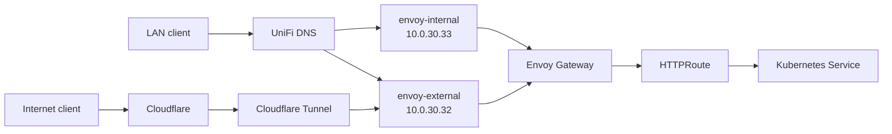

# Network and DNS Reference

This document describes the GitOps-managed network paths in this cluster. The manifests linked below are the source of truth.

## At a glance

| Network or endpoint | Address | Purpose |
| --- | --- | --- |
| Server VLAN | `10.0.30.0/24` | Talos nodes and Cilium load-balancer addresses |
| Kubernetes pods | `10.69.0.0/16` | Workload network |
| Kubernetes services | `10.96.0.0/16` | Cluster-internal service network |
| Kubernetes API VIP | `10.0.30.30` | Highly available Talos control-plane endpoint |
| `envoy-external` | `10.0.30.32` | Publicly exposed application routes and their LAN path |
| `envoy-internal` | `10.0.30.33` | LAN-only application routes |

Talos nodes use static addresses on the server VLAN and a 9000-byte MTU. Cilium advertises load-balancer services to UniFi through BGP and also has L2 announcements enabled; the definitions are in [`networks.yaml`](../kubernetes/apps/kube-system/cilium/app/networks.yaml).

## Request paths



The Cloudflare Tunnel establishes outbound connections from the cluster to Cloudflare.

## Exposure model

Envoy Gateway terminates HTTPS for two Gateway API `Gateway` resources. Both use the `network/unscfleet-com-tls` secret and redirect HTTP to HTTPS.

| Gateway | Intended audience | DNS anchor | GitOps source |
| --- | --- | --- | --- |
| `envoy-external` | Internet and LAN | `external.unscfleet.com` | [`envoy.yaml`](../kubernetes/apps/network/envoy-gateway/app/envoy.yaml) |
| `envoy-internal` | LAN only | `internal.unscfleet.com` | [`envoy.yaml`](../kubernetes/apps/network/envoy-gateway/app/envoy.yaml) |

An application is exposed by an `HTTPRoute`. Its `parentRefs` selects the gateway, and its `hostnames` selects the DNS name. The gateway selection is the access-policy decision: do not repoint DNS between the two gateways to work around an application issue. Change the application's `HTTPRoute` in Git instead.

## Split DNS

Two ExternalDNS deployments own separate DNS planes for `unscfleet.com`.

| Controller | DNS plane | Sources | Ownership records |
| --- | --- | --- | --- |
| `unifi-dns` | LAN split DNS in UniFi | `Gateway`/`HTTPRoute`, `Service` | owner `main`, prefix `zz.k8s.main.` |
| `cloudflare-dns` | Public Cloudflare DNS | `Gateway`/`HTTPRoute`, `DNSEndpoint` | owner `default`, prefix `k8s.` |

For LAN clients, ExternalDNS normally creates application CNAMEs to one of the anchors, which resolves to its Envoy load-balancer address:

```text
# External application
audiobooks.unscfleet.com  CNAME  external.unscfleet.com
external.unscfleet.com    A      10.0.30.32

# LAN-only application
sonarr.unscfleet.com      CNAME  internal.unscfleet.com
internal.unscfleet.com    A      10.0.30.33
```

Record shape can change with controller versions; the invariant is that a hostname resolves to the address of the gateway chosen by its `HTTPRoute`.

The `zz.k8s.main.*` TXT records are ExternalDNS ownership metadata, not application records. Preserve them: an ownership mismatch prevents the controller from accidentally overwriting records it does not own. Avoid manual UniFi DNS changes, because the next reconciliation can replace them.

## Public DNS and tunnel

`cloudflare-dns` publishes records for the external gateway only. The Cloudflare Tunnel configuration forwards the apex and wildcard hostname traffic to `envoy-external` in the cluster; `teleport.unscfleet.com` is an explicit exception that is forwarded directly to its service. See [`cloudflare-tunnel`](../kubernetes/apps/network/cloudflare-tunnel/app/) and [`cloudflare-dns`](../kubernetes/apps/network/cloudflare-dns/app/).

## TLS

cert-manager issues a Let's Encrypt production certificate for the apex domain and wildcard subdomain. The `Certificate` resource stores it as `network/unscfleet-com-tls`, which both Envoy gateways reference. See [`certificate.yaml`](../kubernetes/apps/network/certificates/export/app/certificate.yaml).

A gateway `404` usually indicates that no matching `HTTPRoute` exists on that gateway; it is not, by itself, a certificate failure.

## Troubleshooting

Investigate in this order:

1. Inspect the `HTTPRoute` hostname, `parentRefs`, and Accepted/ResolvedRefs status.
2. Confirm the expected LAN A/CNAME answer and related TXT ownership record.
3. Test HTTPS against the selected private gateway address.
4. Inspect the relevant ExternalDNS or gateway logs.

```sh
kubectl get httproute -A
kubectl -n network get gateway envoy-external envoy-internal
kubectl -n network logs deploy/unifi-dns --since=10m
kubectl -n network logs deploy/cloudflare-dns --since=10m

dig +short sonarr.unscfleet.com A
dig +short sonarr.unscfleet.com CNAME
dig +short zz.k8s.main.cname-sonarr.unscfleet.com TXT

curl -ksS -o /dev/null -w '%{http_code}\n' \
  --resolve sonarr.unscfleet.com:443:10.0.30.33 \
  https://sonarr.unscfleet.com/
```

Modern browsers may use HTTPS/SVCB records in addition to ordinary A/CNAME lookups. If browser behavior differs from `dig` or `curl --resolve`, verify the route and certificate first; then inspect the browser DNS cache and HTTPS/SVCB behavior. Cluster CoreDNS is for pods only, so changing it does not alter DNS for LAN desktops.

## Change rules

- Make reachability changes through `HTTPRoute` manifests and let Flux reconcile them.
- Treat external and internal gateway placement as intentional access policy.
- Preserve ExternalDNS TXT ownership configuration unless performing a planned migration.
- Treat ExternalDNS upgrades as behavior changes: render and test DNS behavior before merging.
- Do not restart controllers, recreate records, or bulk-delete records while diagnosing a single hostname.
