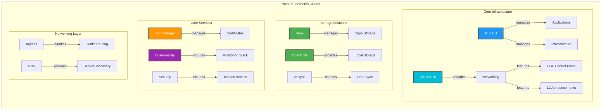

# HomeOps Documentation

Welcome to the HomeOps documentation! This site contains information about the setup, configuration, and maintenance of my home infrastructure managed through GitOps principles.

## Infrastructure Overview

## Quick Links

- [Tools](Tools.md) - Essential tools used in this infrastructure
- [Commands](Commands.md) - Common commands and operations
- [Scripts](Scripts.md) - Useful scripts for automation
- [PiKVM](Pikvm.md) - PiKVM setup and configuration
- [Teleport](Teleport.md) - Teleport access management
- [Semantic Commits](SemanticCommits.md) - Commit message guidelines
