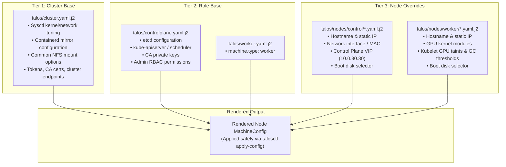
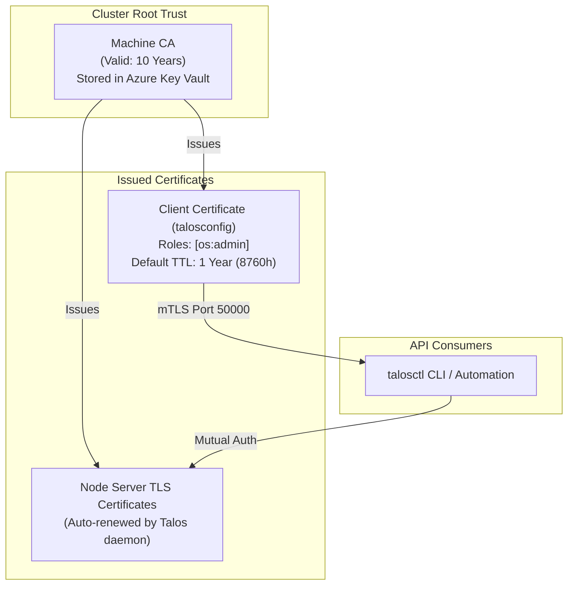

# Talos Configuration, Architecture, and Certificate Management

This document details the Talos Linux bootstrapping architecture, configuration layering model, and certificate lifecycle management used in this cluster.

---

## 1. Overview & Architecture

Talos Linux is an immutable, secure, minimal operating system designed exclusively for Kubernetes. It contains no SSH daemon, no shell, and no console login. All administrative actions occur over **mutual TLS (mTLS) via the Talos API on port 50000**.

### Configuration Layering Model

Rather than monolithic, copy-pasted machine configurations, node configurations are dynamically generated in a three-tier model using native `talosctl machineconfig patch`:



### Factory Schematic Architecture

Extensions and drivers (such as Intel microcode, NVIDIA GPU kernel modules, and container toolkits) are built into immutable Talos installer images via the [Talos Image Factory](https://factory.talos.dev):

| Profile | Schematic Definition | Extensions Included | Target Nodes |
| :--- | :--- | :--- | :--- |
| **Control Plane** | `talos/schematic.yaml.j2` | `siderolabs/intel-ucode`, `siderolabs/i915`, `siderolabs/intel-ice-firmware`, `siderolabs/thunderbolt`, `siderolabs/util-linux-tools` | `fleetcom-node1`, `fleetcom-node2`, `fleetcom-node3` |
| **GPU Worker** | `talos/nodes/worker/10.0.30.6.schematic.yaml.j2` | `siderolabs/amd-ucode`, `siderolabs/iscsi-tools`, `siderolabs/nvidia-open-gpu-kernel-modules-production`, `siderolabs/nvidia-container-toolkit-production`, `siderolabs/util-linux-tools` | `fleetcom-node4` |

Schematic hashes are resolved dynamically from the Factory API at render time, ensuring the configuration installer image always matches the declared schematic.

---

## 2. Certificate Architecture & Lifecycle

Talos manages multiple distinct certificate authorities (CAs) for machine operations, Kubernetes components, and etcd.



### Machine CA vs. Client Certificates

1. **Machine CA (`Talos-Machine-CA-Crt` / `Talos-Machine-CA-Key`):**
   - The root authority for all node-to-node and client-to-node authentication.
   - **Validity:** 10 years (typically valid for a decade from cluster bootstrap).
   - Because the CA is long-lived, cluster certificates do not require root recreation.
2. **Client Certificate (`crt` and `key` inside `talosconfig`):**
   - Issued to administrators with the `os:admin` role.
   - **Validity:** 1 year (`8760h`) by default.
   - Can be renewed online at any time through a control-plane node or offline using the Machine CA key.

---

## 3. Secret Management in Azure Key Vault

All cluster secrets are stored in Azure Key Vault and dynamically injected at render time via `az-inject.sh` using `azkv://<vault-name>/<secret-name>` references.

### Key Vault Secret Inventory

| Key Vault Secret Name | Contents / Purpose | Lifespan |
| :--- | :--- | :--- |
| `Talos-Config` | Complete `talosconfig` file with endpoints and valid client credentials | Synced on renewal |
| `Talos-Config-Crt` | Base64-encoded client certificate PEM | Synced on renewal |
| `Talos-Config-Key` | Base64-encoded client private key PEM | Synced on renewal |
| `Talos-Machine-CA-Crt` | Machine CA public certificate | 10 Years |
| `Talos-Machine-CA-Key` | Machine CA private key (for disaster recovery and control plane nodes) | 10 Years |
| `Talos-Cluster-CA-Crt` | Kubernetes Cluster CA certificate | 10 Years |
| `Talos-Cluster-CA-Key` | Kubernetes Cluster CA private key | 10 Years |
| `Talos-Machine-Token` | Node registration token | Permanent |
| `Talos-Cluster-Token` | Cluster bootstrap token | Permanent |
| `Talos-Cluster-Secret` | Cluster shared secret | Permanent |

> [!IMPORTANT]
> The complete file secret `Talos-Config` and the split secrets `Talos-Config-Crt`/`Talos-Config-Key` must remain synchronized. The `just talos backup-talosconfig` recipe handles this synchronization automatically.

---

## 4. Operational Workflows & Recipes

All Talos operational tasks are orchestrated through `just`. Run `just -l talos` to view all available commands.

### Inspecting Certificate Expiration

Check the remaining validity period of your current `talosconfig`:

```bash
just talos config-info
```

Output displays the active context, cluster endpoints, roles, and expiration date:
```text
Current context:     fleetcom
Nodes:               10.0.30.11, 10.0.30.12, 10.0.30.13
Endpoints:           10.0.30.11, 10.0.30.12, 10.0.30.13
Roles:               os:admin
Certificate expires: 4 months from now (2027-01-31)
```

---

### Renewing Client Certificates (Online Workflow)

You do not need to wait until a certificate expires to renew it. Renewal causes zero cluster downtime.

1. **Issue a new certificate via any active control plane node:**
   ```bash
   # Default 1-year renewal (8760 hours)
   just talos renew-talosconfig 10.0.30.11

   # Or request a multi-year duration (e.g., 3 years = 26280 hours)
   just talos renew-talosconfig 10.0.30.11 26280h
   ```
2. **Synchronize the renewed credentials to Azure Key Vault:**
   ```bash
   just talos backup-talosconfig
   ```
   This recipe updates `Talos-Config`, `Talos-Config-Crt`, and `Talos-Config-Key` simultaneously in Azure Key Vault.

---

### Rendering & Validating Node Configurations

To generate a node's complete configuration without applying it:

```bash
# Render to stdout
just talos render-config 10.0.30.11

# Validate syntax against Talos schema
just talos render-config 10.0.30.11 | talosctl validate -c /dev/stdin -m metal
```

### Performing a Safe Dry-Run Apply

To test what changes would occur on a running node before applying:

```bash
just talos render-config 10.0.30.11 | talosctl -n 10.0.30.11 apply-config --dry-run -f /dev/stdin
```

If no changes are pending, the Talos daemon will confirm:
```text
Dry run summary:
Applied configuration without a reboot (skipped in dry-run).
Config diff:

No changes.
```

### Applying Configuration Changes

When you are ready to apply updates to a node:

```bash
# Interactive prompt with auto-reboot detection
just talos apply-node 10.0.30.11

# For non-disruptive changes (preventing reboots)
just talos apply-node 10.0.30.11 -m no-reboot
```

---

## 5. Disaster Recovery: Recovering from Expired Certificates

If a client certificate expires before renewal, `talosctl` commands will fail with:
```text
remote error: tls: expired certificate
```

Because the Machine CA private key is safely preserved in Azure Key Vault, you can always recover access offline without reinstalling nodes:

```bash
# 1. Retrieve the Machine CA certificate and key from Key Vault
az keyvault secret show --vault-name "<vault-name>" --name "Talos-Machine-CA-Crt" --query "value" -o tsv | base64 -d > ca.crt
az keyvault secret show --vault-name "<vault-name>" --name "Talos-Machine-CA-Key" --query "value" -o tsv | base64 -d > ca.key

# 2. Generate a new client certificate signed by the Machine CA offline
talosctl config new talos/talosconfig \
    --roles os:admin \
    --crt-ttl 8760h \
    --ca-cert ca.crt \
    --ca-key ca.key

# 3. Clean up temporary CA files immediately
rm -f ca.crt ca.key

# 4. Backup the recovered credentials to Azure Key Vault
just talos backup-talosconfig
```
